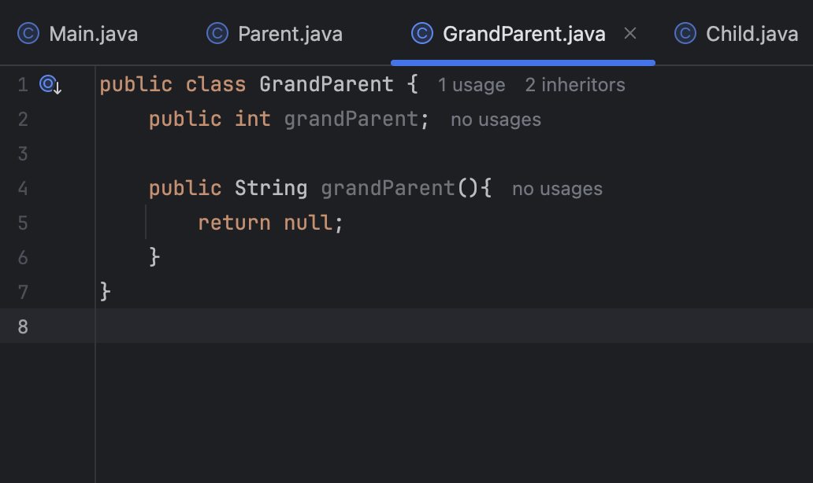
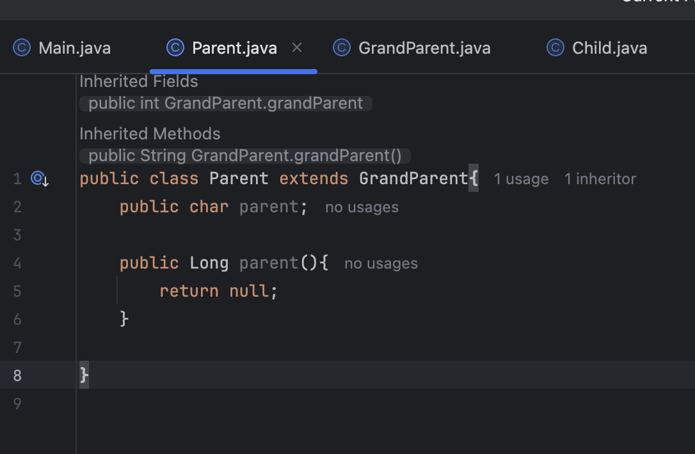
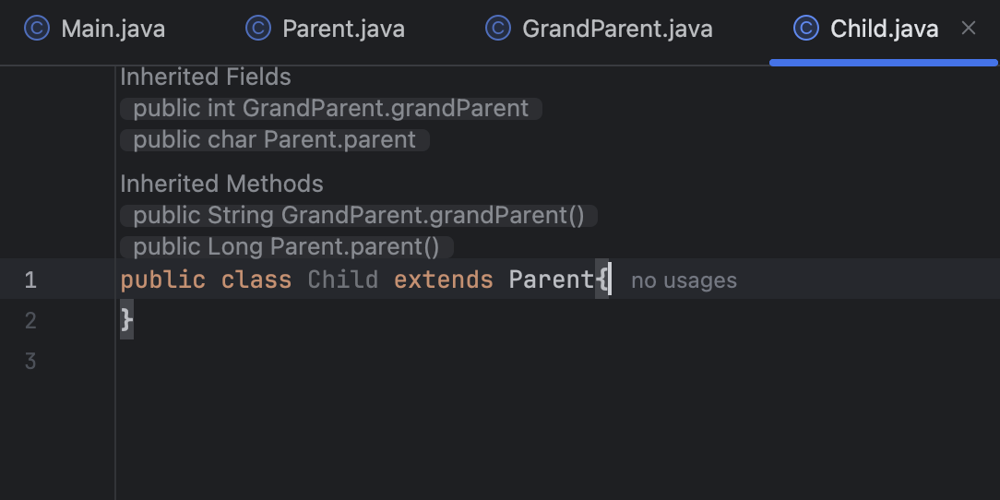

# TransparentClass

A plugin that visually shows the relationship between inherited classes in IntelliJ IDEA.

## Description

The Transparent Class plugin shows non-private inherited fields and methods from the superclass directly inside your class editor. This makes it easier to understand the full capabilities of a class without navigating to the parent class.

## Features

* **Deep Inheritance View**: Displays inherited members from the entire class hierarchy, not just the direct parent.
* **Source Class Display**: Shows the name of the class from which each member is inherited, formatted like `public void Parent.test()`.
* **Quick Navigation**: Click on a hint to navigate to the member's declaration.
* **Smart Filtering**: Hides common members from `java.lang.Object` for a cleaner interface.

## Example Usage
**Superclass (`GrandParent.java`):**

**Superclass (`Parent.java`):**

**Subclass (`Child.java`) with the plugin active:**

## Compatibility

* **IntelliJ IDEA Version**: 2025.2.2
* **Plugin Compatibility**: Supports from version 232 (2023.2) to 242.\* (2024.2.\*)
* **Language**: JAVA

## License

This project is licensed under the Apache License 2.0. For more details, see the [LICENSE](https://www.google.com/search?q=LICENSE) file.