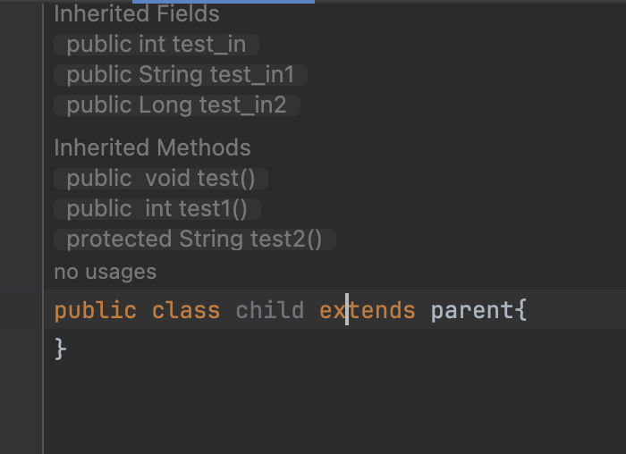
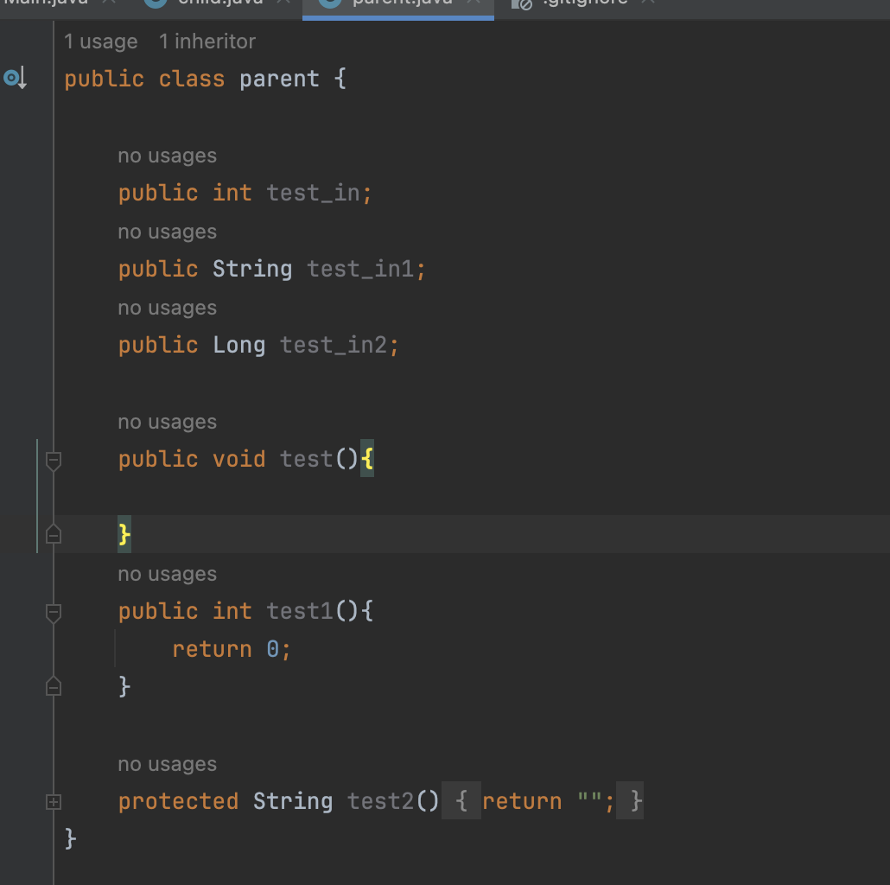

# TransparentClass

A plugin that visually shows the relationship between inherited classes in IntelliJ IDEA.

## Description

The Transparent Class plugin shows non-private inherited fields and methods from the superclass directly inside your class editor. This makes it easier to understand the full capabilities of a class without navigating to the parent class.

## Features

* **Display Inherited Members**: Displays inherited members as inlay hints.
* **Quick Navigation**: Click on a hint to navigate to the member's declaration.
* **Visibility**: Shows inherited public/protected fields and methods.

## Example Usage

**Before applying the plugin:**

**After applying the plugin:**

## Compatibility

* **IntelliJ IDEA Version**: 2023.2.6
* **Plugin Compatibility**: Supports from version 232 (2023.2) to 242.\* (2024.2.\*)
* **Language**: JAVA

## License

This project is licensed under the Apache License 2.0. For more details, see the [LICENSE](https://www.google.com/search?q=LICENSE) file.